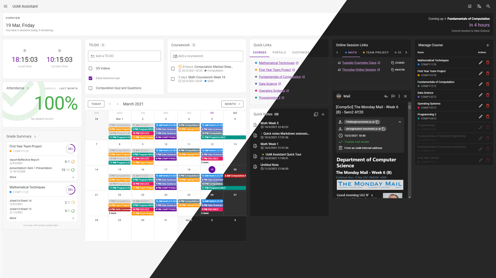

# UoM Assistant

An all-in-one productivity tool to help coordinate uni work. Designed for you.



## Development

**This project is still under development.** Please don't use it as a final product.

### Progress

Frontend:

- [x] Clock widget
- [x] TO-DO widget
- [x] Coursework widget
- [x] Course manage widget
- [x] Calendar widget
- [x] Quick links widget
- [x] Online session links widget
- [x] Quick notes widget
- [x] Attendance widget
- [x] Overview widget
- [x] Inbox widget
- [x] Grade summary widget
- [ ] Search
- [ ] Set up guide
- [ ] Settings page
- [ ] About page
- [ ] Logo

Backend:

- [ ] Database
- [x] Ability check API
- [x] Attendance API
- [x] Calendar API
- [x] Inbox API
- [x] Send mail API
- [x] Grade summary API
- [ ] Sync settings API
- [ ] Clear data API
- [ ] CLI tools

## Introduction

UoM Assistant is a web app that offers many helpful tools for students in Department of Computer Science, University of Manchester. All the information you need for your study life is now in one place and reachable with a glance.

This project was originally a personal project, born during the pandemic with all the courses were moved to be online, and I needed a panel that could gather and display all the information I needed for study. As the project gradually improved, I started to develop it as a formal project. Therefore UoM Assistant also contains many useful features for remote study.

## Features

- Get known of your course schedule with a glance
- Open online sessions by one click
- Easily check your attendance and grades
- Forget how to calculate the time difference, let the widget tell you
- Precise time zone and DST support
- Control all your private data and safely sync them across devices
- Elegant and easy-to-use UI with dark mode support
- i18n support: English (UK) and Chinese (Simplified)
- ...

## Deploy guide

### Frontend

Download latest `frontend.zip` from [Releases](https://github.com/yrccondor/uom-assistant/releases), and decompress the files to the root directory of your site. Note that UoM Assistant must be deployed to the root directory of a site.

To make router working properly, you need to update the config of your server. If you are using Nginx, you can add these lines to your site config:

```nginx
location / {
  try_files $uri $uri/ /index.html;
}
```

or you may using Apache:

```apache
<IfModule mod_rewrite.c>
  RewriteEngine On
  RewriteBase /
  RewriteRule ^index\.html$ - [L]
  RewriteCond %{REQUEST_FILENAME} !-f
  RewriteCond %{REQUEST_FILENAME} !-d
  RewriteRule . /index.html [L]
</IfModule>
```

### Backend

Download latest `backend.zip` from [Releases](https://github.com/yrccondor/uom-assistant/releases), and decompress the files to the right place of your site. Edit `config.php`, and your backend is now on. Note that to enable mail related features you need to install following PHP extentions: `fileinfo`, `imap` and `mbstring`.

### Deploy with Docker

If you are using docker, `docker-compose.yml` has already offered you a good start. Check out the file and modify it as you want.

## Build and deploy from source

Make sure you have `npm` and `composer` installed.

### Frontend

```shell
$ npm install
$ npm run build
```

...and deploy the `dist` folder.

### Backend

```shell
$ cd backend
```

...edit `config.php`, then

```shell
$ composer install --no-dev --optimize-autoloader
$ cd ../
```

...and deploy the `backend` folder.
